# LegalCRM
This is a basic web application which was created in Java.
You may access and test this app via: https://legal-crm.herokuapp.com/  (see login details below)

### Tools and frameworks used
Spring MVC, Hibernate, Spring Security, Spring Data, JavaScript, MySQL, Bootstrap 

### Purpose
This application could be used by a law firm for the purposes of on-going case management. Apps main functionality is control of work time of employees by admin - app gives admin (and also user) a convenient and intuitive insight into working time entered via timesheet. Admin may generate reports and charts based on the data inserted to the database by employees.

#### Landing page
Landing page gives insight into what crm software is and its usefullness as a tool.

#### Login
In order to enjoy app's entire functionality it is required of a user to login. Admin account login: adam.kowalski@PKlegal.pl password: 12341234 (full functionality, i.a. report generation etc.). User account login: k.janicki@PKlegal.pl password: 12341234 (limited actions allowed).

#### Home section
Admin home section gives insight into previous month statistics of all employees and recently added timesheets. User may only see his own recent month's statistics. 
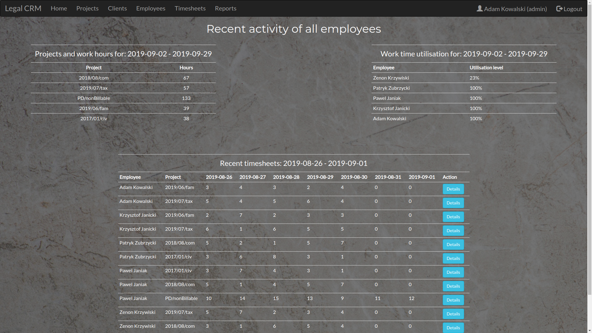

#### Projects
Admin may add, edit and delete projects. User may only see input data.
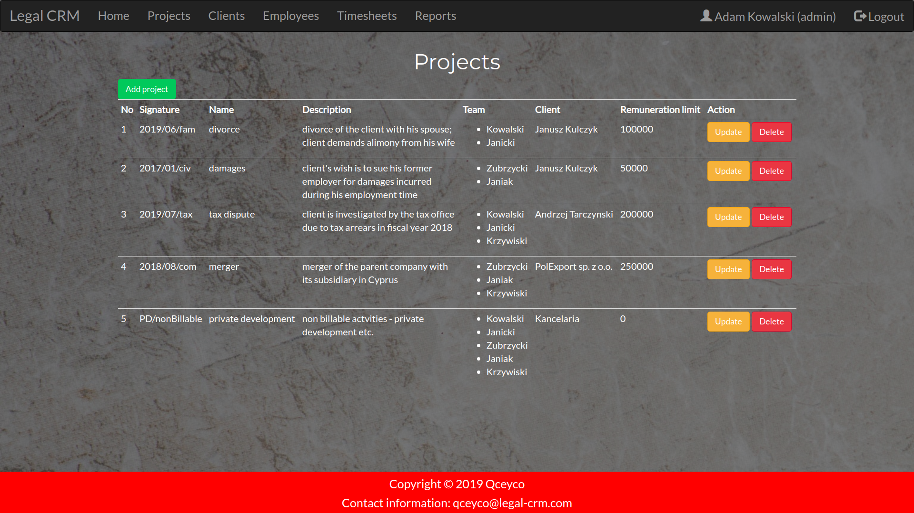

#### Adding new project
When data input is insufficient there is an appropriate message.
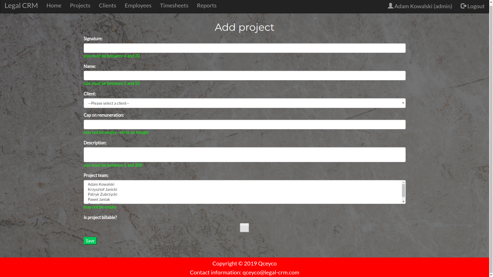

#### Clients
Admin may add, edit and delete clients. User may only see input data.

#### Client details
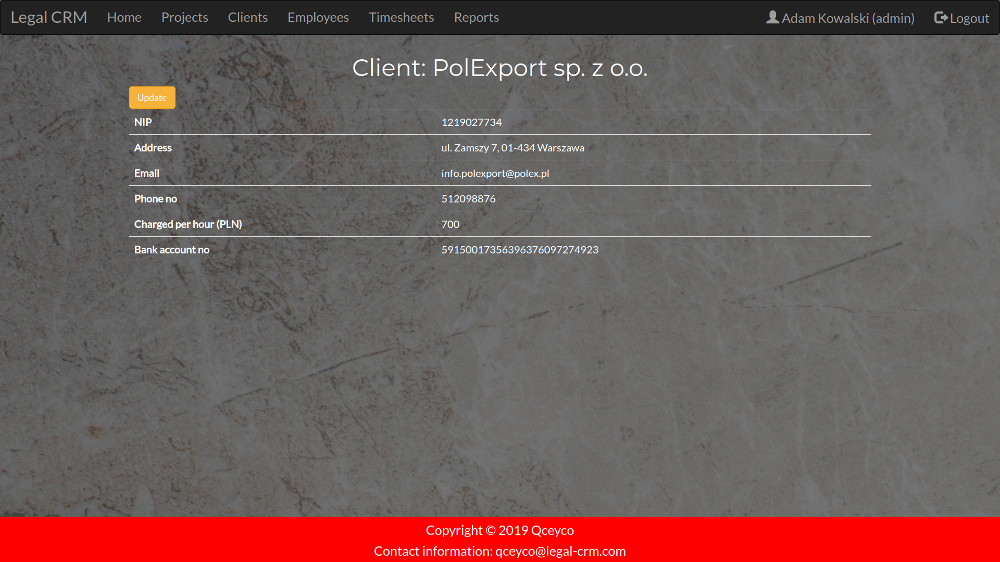

#### Employees
Admin may add, edit and delete employees. User may only see input data.
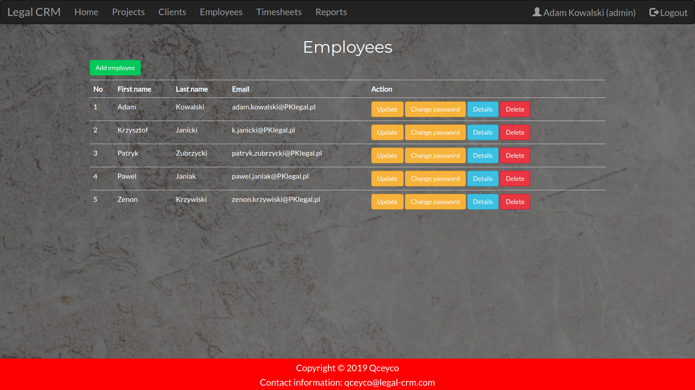

#### Timesheets
Each user may add, edit and delete his timesheets. Admin has access to timesheets of all users.
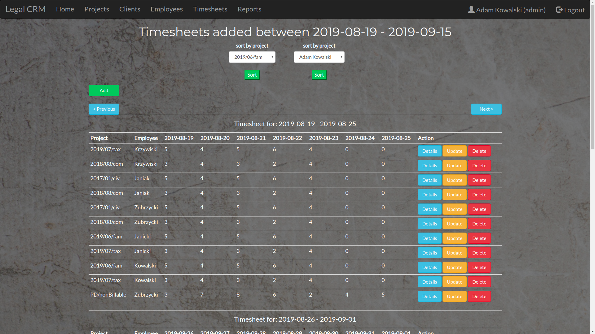

#### Adding new timesheet
In case when there is an existing timesheet - user is informed about it.
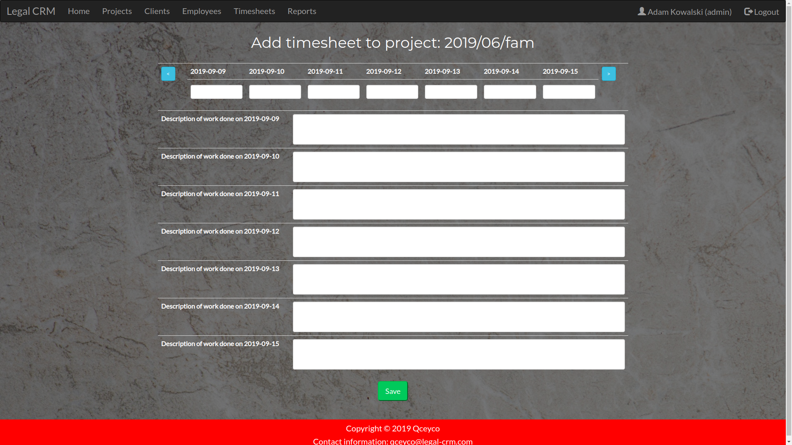

#### Timesheet details
Each timesheet may be analyzed.
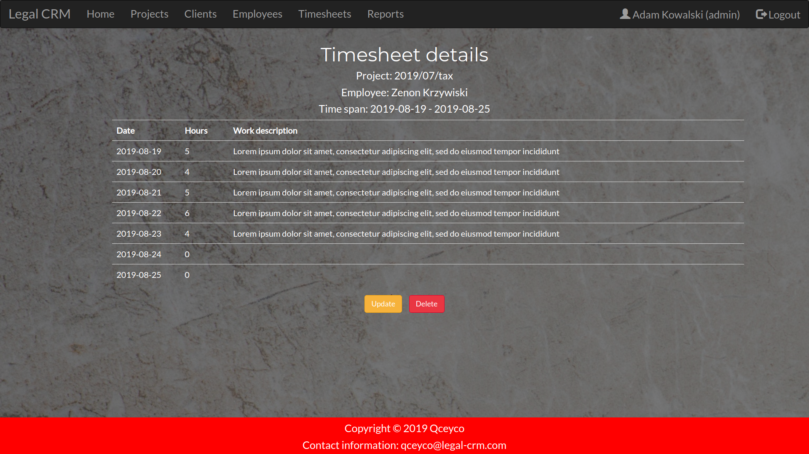

#### Reports
Admin may generate reports which are generated based on the timesheet data.
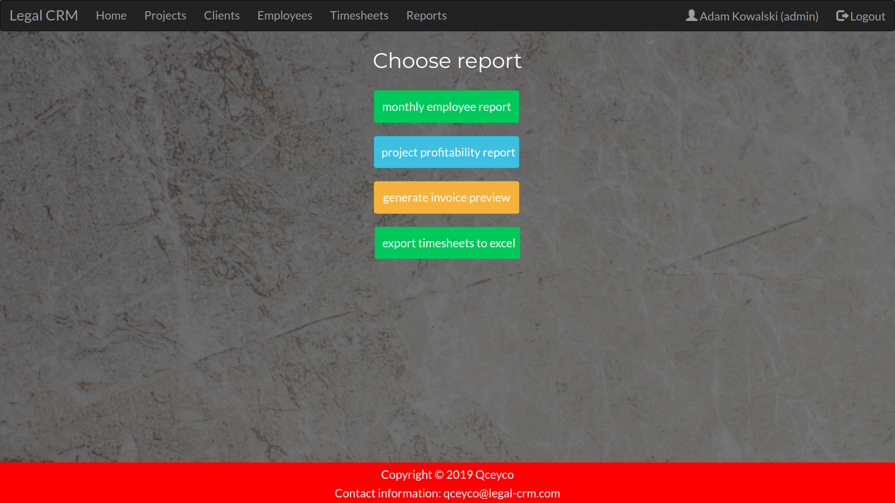

#### Employee report form
In order to generate a report there is an appropriate validation of input data.

#### Employee report
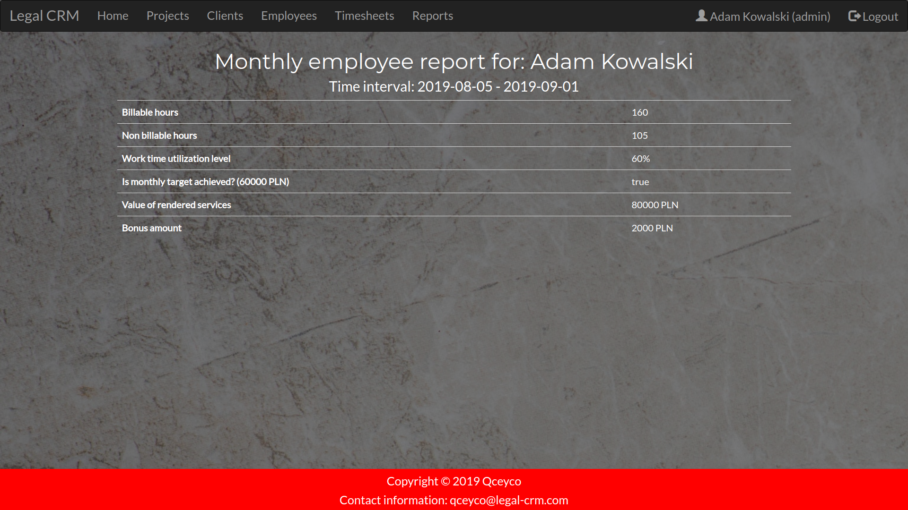

#### Project report
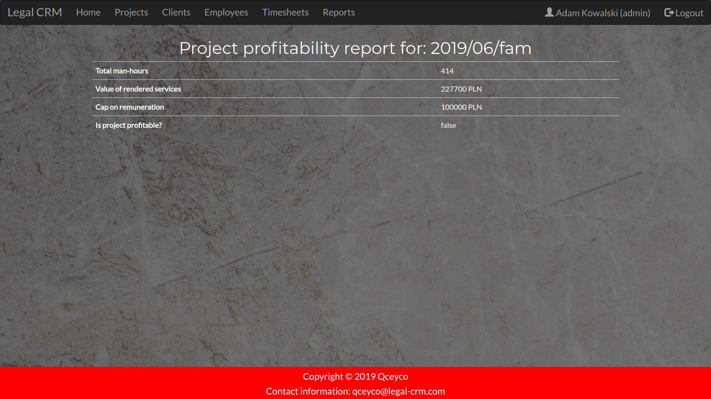

#### Invoice preview report
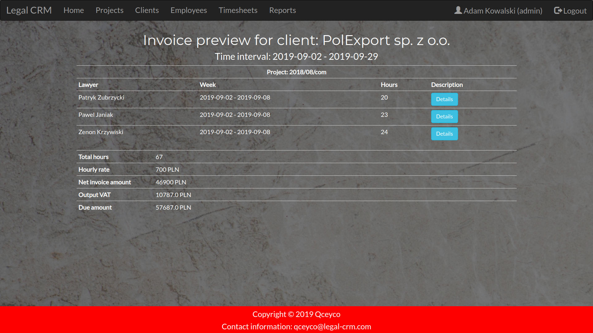

#### Export timesheets to excel file
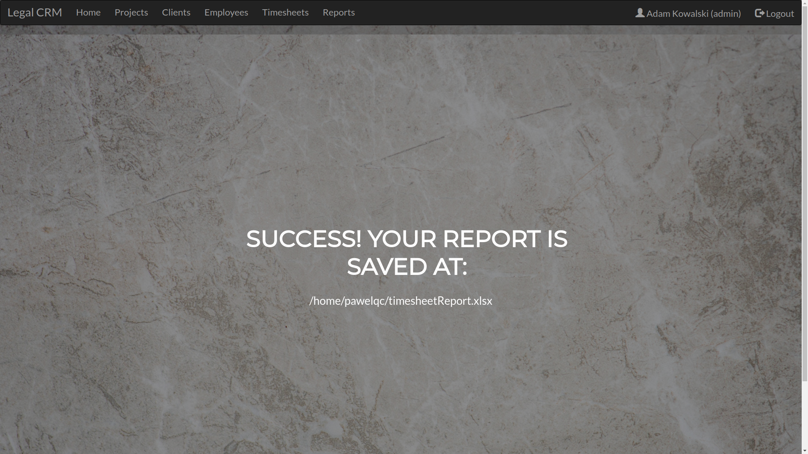

#### Generated excel file
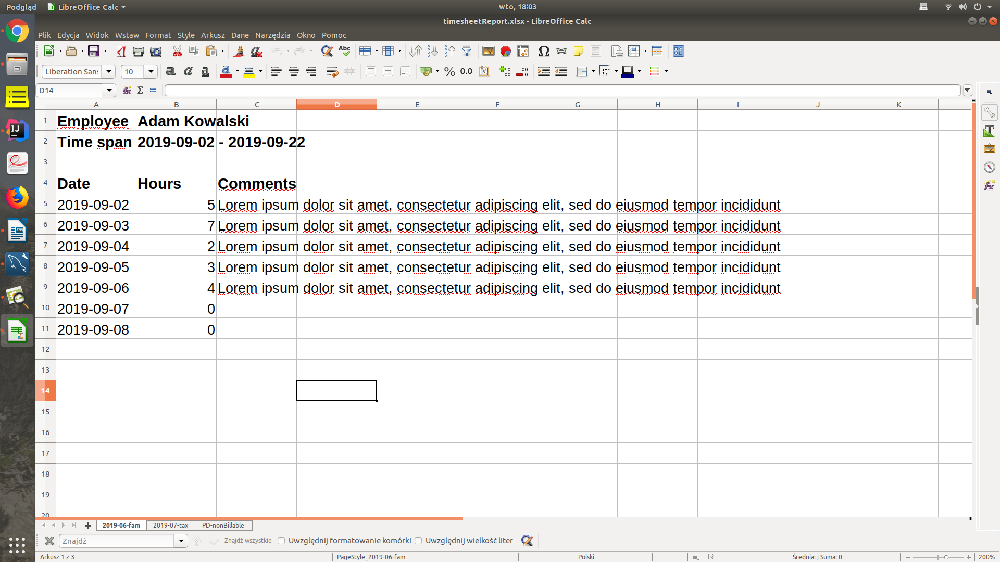

#### Logout
